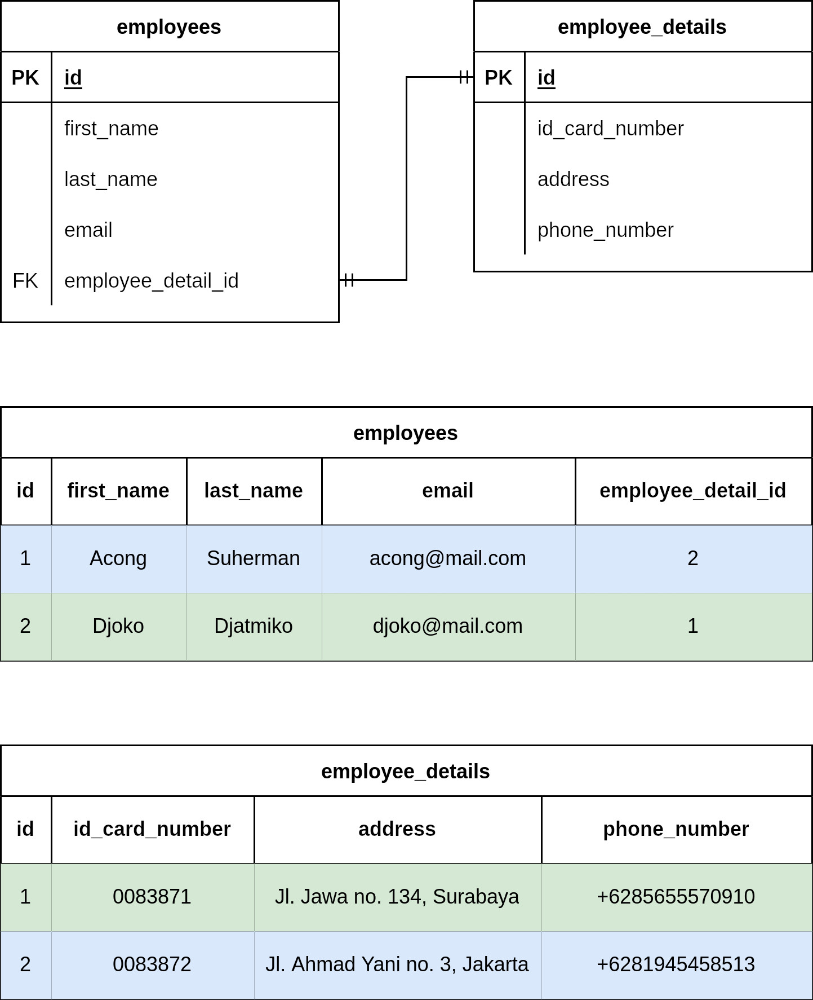
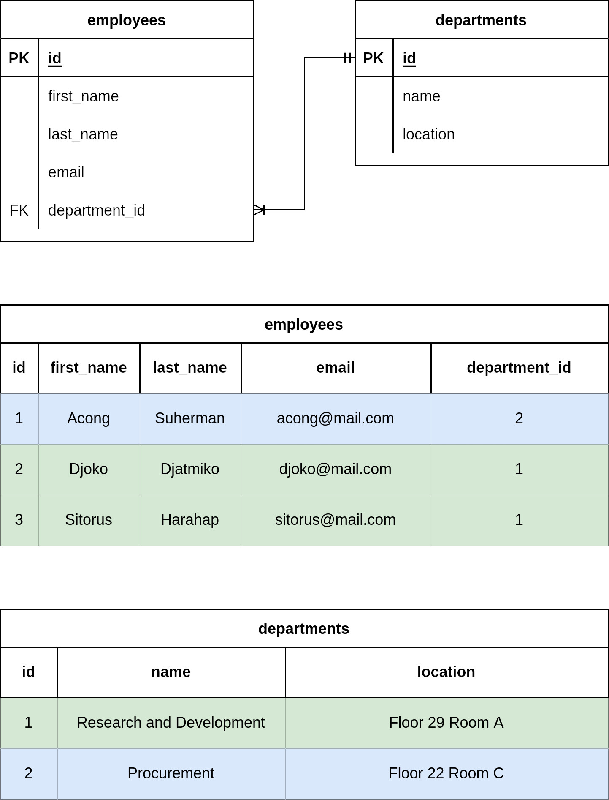
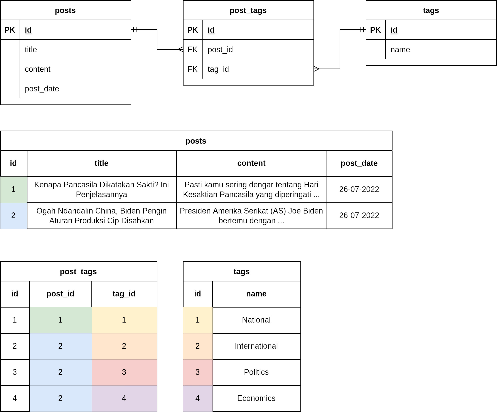

# Database

Contents:

- [Installation](#installation)
  - [RDBMS](#rdbms)
  - [GUI Client](#gui-client)
  - [Troubleshooting](#troubleshooting)
- [Introduction](#introduction)
- [Conventions](#conventions)
- [Relationship cardinality](#relationship-cardinality)
- [Data Definition Language (DDL)](#data-definition-language-ddl)
- [Data types](#data-types)
- [Constraints](#constraints)
- [Example](#example)
- [Practice 1](#practice-1)
- [Demo database](#demo-database)
- [Practice 2](#practice-2)
- [Practice 3](#practice-3)
- [Practice 4](#practice-4)
- [Additional challenges](#additional-challenges)

## Installation

### RDBMS

**PostgreSQL**

```
# Create the file repository configuration:
sudo sh -c 'echo "deb http://apt.postgresql.org/pub/repos/apt $(lsb_release -cs)-pgdg main" > /etc/apt/sources.list.d/pgdg.list'

# Import the repository signing key:
wget --quiet -O - https://www.postgresql.org/media/keys/ACCC4CF8.asc | sudo apt-key add -

# Update the package lists:
sudo apt-get update

# Install the latest version of PostgreSQL.
# If you want a specific version, use 'postgresql-12' or similar instead of 'postgresql':
sudo apt-get -y install postgresql
```

[Source](https://www.postgresql.org/download/linux/ubuntu/)

### GUI Client

- [DBeaver](https://dbeaver.io/download/)
- [pgAdmin](https://www.pgadmin.org/download/)
- GoLand

### Troubleshooting

[Reset forgotten password for postgres user](https://www.postgresqltutorial.com/postgresql-administration/postgresql-reset-password/)

> In Ubuntu, **pg_hba.conf** is located at **/etc/postgresql/14/main**. You can edit it using editor such as **nano** with command `sudo nano /etc/postgresql/14/main`.

## Introduction

- A database is an organized collection of structured information, or data, typically stored electronically in a computer system. A database is usually controlled by a database management system (DBMS).

  [Source](https://www.oracle.com/database/what-is-database/)

- A relational database is a type of database that stores and provides access to data points that are related to one another. Relational databases are based on the relational model, an intuitive, straightforward way of representing data in tables. In a relational database, each row in the table is a record with a unique ID called the key. The columns of the table hold attributes of the data, and each record usually has a value for each attribute, making it easy to establish the relationships among data points.

  [Source](https://www.oracle.com/database/what-is-a-relational-database/)

- [Benefits of relational databases.](https://www.ibm.com/cloud/learn/relational-databases#toc-benefits-o-wwriGuQF)

- [What is SQL?](https://en.wikipedia.org/wiki/SQL)

- [Why use PostgreSQL?](https://www.postgresql.org/about/)

## Conventions

- Database name should be written as **snake_case** with suffix **\_db**
- Length of database name should be less than 42 characters
- Length of table name should be less than 42 characters
- Field/column name should be written as **snake_case**
- Foreign key should be suffixed with **\_id**
- Primary key with integer value should use **BIGSERIAL** as data type
- Prefer to use numeric value that does not lose precision (**INT**, **DECIMAL**)
- Do not allow **NULL** unless necessary

## Relationship cardinality

- One-to-one (`1:1`)

  

- One-to-many (`1:m`)

  

- Many-to-many (`m:n`)

  

## Data Definition Language (DDL)

- `CREATE`

  Creating a database.

  ```sql
  CREATE DATABASE employees_db;
  ```

  Creating a table.

  ```sql
  CREATE TABLE employees (
    id BIGSERIAL PRIMARY KEY,
    first_name VARCHAR,
    last_name VARCHAR
  );
  ```

- `ALTER`

  Renaming a database.

  ```sql
  ALTER DATABASE employees_db RENAME TO pegawai_db;
  ```

  Renaming a table.

  ```sql
  ALTER TABLE employees RENAME TO pegawai;
  ```

  [More](https://www.tutorialspoint.com/postgresql/postgresql_alter_command.htm)

- `TRUNCATE`

  Deleting all data from a table.

  ```sql
  TRUNCATE TABLE pegawai;
  ```

  It has the same effect as `DELETE` on each table, but since it does not actually scan the tables, it is faster. Furthermore, it reclaims disk space immediately, rather than requiring a subsequent VACUUM operation. This is most useful on large tables.

  [Source](https://www.tutorialspoint.com/postgresql/postgresql_truncate_table.htm)

- `DROP`

  Removing an existing table.

  ```sql
  DROP TABLE pegawai;
  ```

  Removing an existing database.

  ```sql
  DROP DATABASE pegawai_db;
  ```

## Data Types

- [`BOOLEAN`](https://www.postgresql.org/docs/current/datatype-boolean.html)
- [Character](https://www.postgresql.org/docs/current/datatype-character.html)
  - `CHAR(n)`
    Can store strings up to `n` characters (default to 1). Blank padded.
  - `VARCHAR(n)`
    Can store strings up to `n` characters (default to infinity). `VAR` in `VARCHAR` means variable-length. Strings with length less than `n` will not be padded.
  - `TEXT`
    In `TEXT` the concept of `n` does not exists.
- [Numeric](https://www.postgresql.org/docs/current/datatype-numeric.html)
  - Integer
    - `SMALLINT`
    - `INTEGER`
    - `BIGINT`
  - Serial
    Integer with autoincrement.
    - `SMALLSERIAL`
    - `SERIAL`
    - `BIGSERIAL`
  - Arbitrary
    - `DECIMAL` or `NUMERIC`
  - Floating-point
    - `REAL`
    - `DOUBLE PRECISION`
- [Date and time](https://www.postgresql.org/docs/current/datatype-datetime.html)
  - `DATE`
  - `TIME`
  - `TIMESTAMP`

## Constraints

- `CHECK`
- `NOT NULL`
- `UNIQUE (NOT NULL, UNIQUE)`
- `PRIMARY KEY`
- `REFERENCES`
- `EXCLUDE`

[Source](https://www.postgresql.org/docs/current/ddl-constraints.html)

## Example

1. Design an ERD with requirements as below:
   - A user can post an image.
   - Each image will have its own tags.
1. Create a database following the ERD above.

## Practice 1

Design and create a database system with theme of your choice. Your database system must have at least one `1:m` and one `m:n` relationship.

## Demo database

For learning purpose, create a new database then run SQL queries below.

<details>
<summary>Demo database</summary>

```sql
CREATE TABLE categories(
  id BIGSERIAL PRIMARY KEY,
  name VARCHAR,
  created_at TIMESTAMP NOT NULL,
  updated_at TIMESTAMP NOT NULL,
  deleted_at TIMESTAMP
);

CREATE TABLE products(
  id BIGSERIAL PRIMARY KEY,
  category_id BIGINT,
  name VARCHAR,
  stock INTEGER,
  price DECIMAL,
  product_date DATE,
  created_at TIMESTAMP NOT NULL,
  updated_at TIMESTAMP NOT NULL,
  deleted_at TIMESTAMP,
  FOREIGN KEY (category_id) REFERENCES categories(id)
);

INSERT INTO categories(name, created_at, updated_at)
VALUES
('Sembako', '2022-07-01 15:00:00', '2022-07-01 15:00:00'),
('Kesehatan', '2022-07-01 15:00:00', '2022-07-01 15:00:00'),
('Elektronik', '2022-07-01 15:00:00', '2022-07-01 15:00:00');

INSERT INTO products(category_id, name, stock, price, product_date, created_at, updated_at)
VALUES
('1', 'Minyak Kelapa', '15', '20000', '2021-02-03', '2022-07-01 15:00:00', '2022-07-01 15:00:00'),
('1', 'Minyak Sawit', '9', '23000', '2021-02-01', '2022-07-01 15:00:00', '2022-07-01 15:00:00'),
('1', 'Minyak Nabati', '3', '15000', '2021-02-03', '2022-07-01 15:00:00', '2022-07-01 15:00:00'),
('1', 'Beras', '5', '3000', '2021-04-03', '2022-07-01 15:00:00', '2022-07-01 15:00:00'),
('1', 'Gula', '30', '1000', '2021-02-05', '2022-07-01 15:00:00', '2022-07-01 15:00:00'),
('1', 'Gula Merah', '45', '550', '2021-02-16', '2022-07-01 15:00:00', '2022-07-01 15:00:00'),
('1', 'Telur', '28', '2100', '2021-02-17', '2022-07-01 15:00:00', '2022-07-01 15:00:00'),
('2', 'Vitamin C', '5', '50000', '2021-03-08', '2022-07-01 15:00:00', '2022-07-01 15:00:00'),
('2', 'Vitamin D', '20', '160000', '2021-02-09', '2022-07-01 15:00:00', '2022-07-01 15:00:00'),
('2', 'Minyak Ikan Omega 3', '12', '180000', '2021-03-10', '2022-07-01 15:00:00', '2022-07-01 15:00:00'),
('2', 'Vitamin A', '52', '20000', '2021-02-03', '2022-07-01 15:00:00', '2022-07-01 15:00:00'),
('2', 'Minyak Kayu Putih', '12', '15000', '2021-04-12', '2022-07-01 15:00:00', '2022-07-01 15:00:00'),
('2', 'NaCL', '99', '7000', '2021-04-06', '2022-07-01 15:00:00', '2022-07-01 15:00:00'),
('2', 'Betadine', '52', '11000', '2021-02-13', '2022-07-01 15:00:00', '2022-07-01 15:00:00'),
('3', 'Setrika', '2', '230000', '2021-02-14', '2022-07-01 15:00:00', '2022-07-01 15:00:00'),
('3', 'Kulkas ', '4', '1450000', '2021-02-15', '2022-07-01 15:00:00', '2022-07-01 15:00:00'),
('3', 'Televisi', '23', '980000', '2021-03-16', '2022-07-01 15:00:00', '2022-07-01 15:00:00'),
('3', 'Mesin Cuci', '8', '2300000', '2021-03-17', '2022-07-01 15:00:00', '2022-07-01 15:00:00'),
('3', 'Komputer', '17', '1200000', '2021-04-18', '2022-07-01 15:00:00', '2022-07-01 15:00:00'),
('3', 'Lampu', '42', '64000', '2021-02-19', '2022-07-01 15:00:00', '2022-07-01 15:00:00');
```

</details>

## Practice 2

**Data Query Language (DQL)**

[**`SELECT`**](https://www.postgresqltutorial.com/postgresql-tutorial/postgresql-select/)

1. Get the name, stock and price of all records from products table.

**Data Manipulation Language (DML**)

[**`INSERT INTO`**](https://www.postgresqltutorial.com/postgresql-tutorial/postgresql-insert/)

2. Insert a new record below into products table:
   - category_id: 1
   - name: Kopi
   - stock: 80
   - price: 1500
   - product_date: 2022-07-01
   - created_at: now
   - updated_at: now
   - deleted_at: null

[**`UPDATE`**](https://www.postgresqltutorial.com/postgresql-tutorial/postgresql-update/)

3. Update the record from point 2. Change its stock to 10 and its price to 5900.

[**`DELETE`**](https://www.postgresqltutorial.com/postgresql-tutorial/postgresql-delete/)

4. Delete the record from point 2.
5. What is the meaning of **soft delete**?

## Practice 3

[**`WHERE`**](https://www.postgresqltutorial.com/postgresql-tutorial/postgresql-where/)

1. Get all products with price less than 50000 and stock less than 20.
2. Get all products with price between 3000 and 15000.

[**`ORDER BY`**](https://www.postgresqltutorial.com/postgresql-tutorial/postgresql-order-by/)

3. Get all products then sort by their name (ascending).
4. Get all products then sort by their stock (ascending) and price (descending).

[**`LIKE` and `ILIKE`**](https://www.postgresqltutorial.com/postgresql-tutorial/postgresql-like/)

5. Get all products with name starts with "Minyak".
6. Get all products with name starts with "minyak" (case-insensitive).

[**`LIMIT` and `OFFSET`**](https://www.postgresqltutorial.com/postgresql-tutorial/postgresql-limit/)

7. Get the first four products.
8. Get the next four products from point 7.

[**Join**](https://www.postgresqltutorial.com/postgresql-tutorial/postgresql-joins/)

9. Get all products along with their category name.
10. Get all products along with their category name, where their category is **Sembako** and product date is from 1 January 2021 to 31 March 2021.
11. Demonstrate the differences between `INNER JOIN`, `LEFT OUTER JOIN`, `RIGHT OUTER JOIN` and `FULL OUTER JOIN`.

## Practice 4

**Aggregate and group by**

- [Aggregate reference](https://www.postgresqltutorial.com/postgresql-aggregate-functions/)
- [`GROUP BY` reference](https://www.postgresqltutorial.com/postgresql-tutorial/postgresql-group-by/)

1. Get the total records of products.
2. Get the highest price of products.
3. Get the total stock of all products.
4. Get the total number of products for each category name.

## Additional challenges

- [The Report](https://www.hackerrank.com/challenges/the-report/problem)
- [Top Competitors](https://www.hackerrank.com/challenges/full-score/problem)
- [Contest Leaderboard](https://www.hackerrank.com/challenges/contest-leaderboard/problem)
- [SQL Project Planning](https://www.hackerrank.com/challenges/sql-projects/problem)
- [Occupations](https://www.hackerrank.com/challenges/occupations/problem)
- [Interviews](https://www.hackerrank.com/challenges/interviews/problem)
